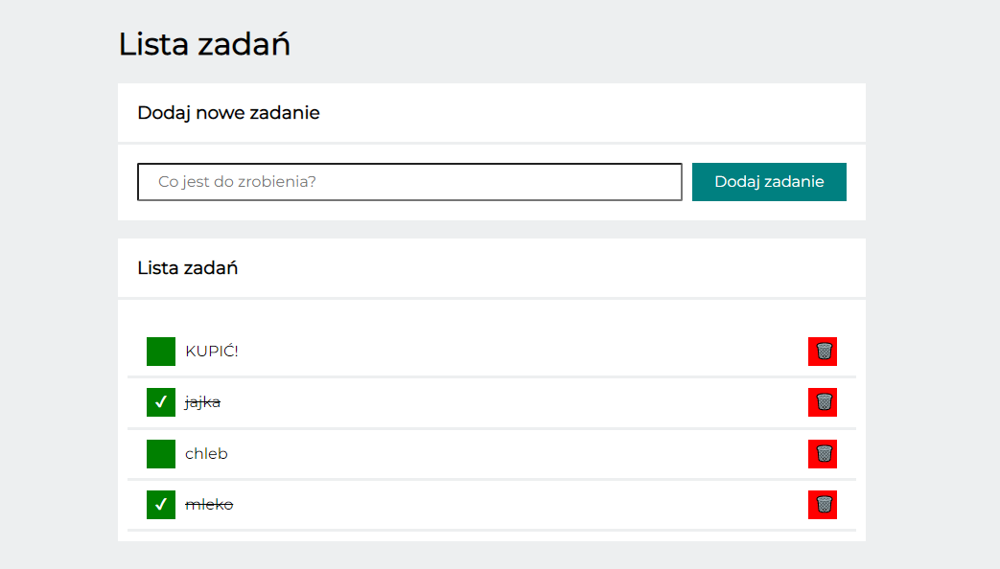
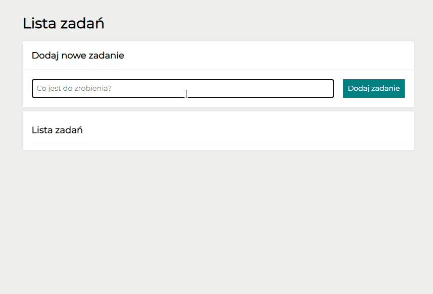

# todo-list-js

## Table of content
1. Demo
1. Description
1. Preview
1. Technologies

## DEMO
https://adriansacha.github.io/todo-list-js/

## 📒 Description
Simple To-Do list application using JavaScript. Add new task to do and then hit green check box if it's done. Trash when you done it.

## 👀 Preview

## 💻 Technologies
* HTML
* CSS
* BEM
* JavaScript
* Flex
* Grid 
* ES6+ features
* Markdown
